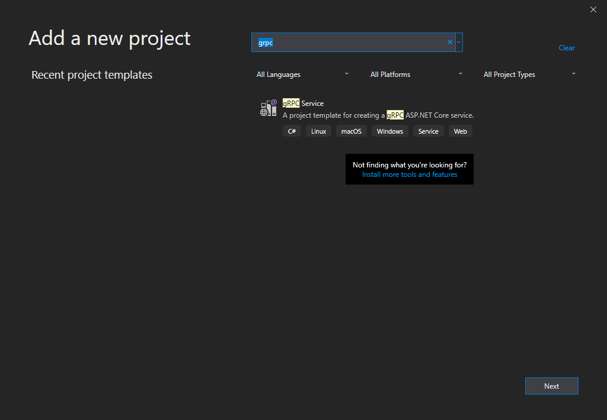
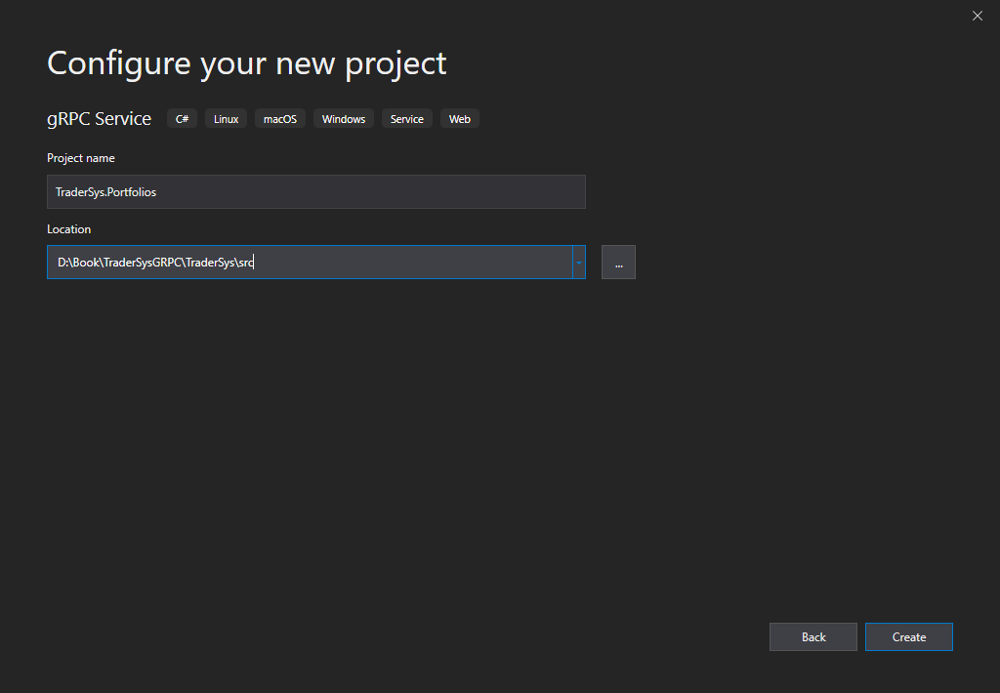

# Create a new ASP.NET Core gRPC project

.NET Core comes with a powerful CLI tool, `dotnet`, which enables you to create and manage projects and solutions from the command line. The tool is closely integrated with Visual Studio 2019, so everything is also available through the familiar GUI interface. This guide will show both ways to create a new ASP.NET Core gRPC project.

## Using Visual Studio 2019

> [!IMPORTANT]
> To work with any .NET Core 3.0 code, you will need at least Visual Studio 2019.3.

Starting with an empty solution created from the *Blank Solution* template, create a Solution Folder called `src`, then right-click on the folder and choose *Add -> New Project...* from the context menu. Enter `grpc` in the template search box and you should see a project template called `gRPC Service`.



Click *Next* to proceed to the *Configure project* dialog and name the project `TraderSys.Portfolios`, and add an `src` sub-directory to the *Location*.



Click *Next* to proceed to the *New gRPC project* dialog.


At present there are limited options for the service creation. Docker will be introduced later in the book, so leave that checkbox unchecked for now and just click *Create*.

## Using the `dotnet` CLI

Create a directory called `TraderSys` and `cd` into it, then use the `dotnet` command to create a new solution.

```console
mkdir TraderSys
cd TraderSys
dotnet new sln
```

> [!TIP]
> The `dotnet new sln` command will use the name of the current directory as the name of the `.sln` file. You can override this behavior by specifying a name with the `--name` flag.

ASP.NET Core 3.0 comes with a CLI template for gRPC services. Create the new project using this template, putting it into an `src` sub-directory as is the convention for ASP.NET Core projects.

```console
dotnet new grpc -o src/TraderSys.Portfolios
```

> [!TIP]
> Again, the `dotnet new grpc` command will use the name of the directory containing the project to name the `.csproj` file, and again, you can override this using the `--name` flag if you want.

Finally, add the project to the solution using the `dotnet sln` command.

```console
dotnet sln add src/TraderSys.Portfolios
```

> [!TIP]
> Since the given directory only contains a single `.csproj` file, you can get away with specifying just the directory to save typing.

You can now open this solution in Visual Studio 2019, Visual Studio Code, or whatever editor you prefer. Screenshots that follow are from Visual Studio 2019.

The gRPC template has helpfully created an example service for us, which was reviewed earlier in the book. Go ahead and rename the `Protos/greet.proto` file to `Protos/portfolios.proto` and open it in your editor, and delete everything after the `package` line, then change the `option csharp_namespace` and `package` as shown below.

```protobuf
syntax = "proto3";

option csharp_namespace = "TraderSys.Portfolios.Protos";

package PortfolioService;
```

> [!TIP]
> The template doesn't add the `Protos` namespace part by default, but adding it makes it easier to keep gRPC-generated classes and your own classes clearly separated in your code.

If you rename the `greet.proto` file in an IDE like Visual Studio, a reference to it in the `.csproj` file will be automatically updated. But in VS Code or some other editors this may not happen, and you'll need to edit the project file manually.

There is a `Protobuf` item element included in the gRPC build targets that lets you specify which `.proto` files should be compiled and which form of code generation is required (i.e. "Server" or "Client").

```xml
<ItemGroup>
  <Protobuf Include="Protos\portfolios.proto" GrpcServices="Server" />
</ItemGroup>
```

>[!div class="step-by-step"]
<!-->[Next](migrating-request-reply.md)-->
