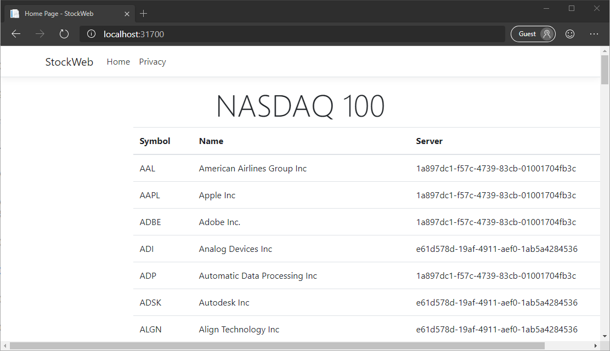

# Service meshes

A service mesh is an infrastructure component that takes control of routing service requests within a network. Service meshes can handle all kinds of network-level concerns within a Kubernetes cluster, including service discovery, load-balancing, fault-tolerance, encryption and monitoring.

Kubernetes service meshes work by adding an extra container, called a *sidecar proxy*, to each pod included in the mesh. The proxy takes over handling all inbound and outbound network requests, allowing configuration and management of networking matters to be kept separate from the application containers and, in many cases, without requiring any changes to the application code.

Take the [previous chapter's example](kubernetes.md#testing-the-application), where the gRPC requests from the web application were all routed to a single instance of the gRPC service. This happens because the service's hostname is resolved to an IP address, and that IP address is cached for the lifetime of the `HttpClientHandler` instance. It might be possible to work around this by handling DNS lookups manually or creating multiple clients, but this would complicate the application code considerably without adding any business or customer value.

Using a service mesh, the requests from the application container are sent to the sidecar proxy, which can distribute them intelligently across all instances of the other service.

Here is a screenshot of the StockWeb application running with the Linkerd service mesh, with no changes to the application code, or even the Docker image being used. The only change required was the addition of an annotation to the Deployment in the YAML files for the `stockdata` and `stockweb` services.

You can see from the Server column that the requests from the StockWeb application have been routed to both replicas of the StockData service, despite originating from a single `HttpClient` instance in the application code.

Service meshes only apply to traffic within a cluster. For external clients, see [the next chapter, Load Balancing](load-balancing.md).

## Service mesh options

There are three general-purpose service mesh implementations currently available for use with Kubernetes: Istio, Linkerd and Consul Connect. All three provide request routing/proxying, traffic encryption, resilience, host-to-host authentication and traffic control.

Choosing a service mesh depends multiple factors: the organization's specific requirements around costs, compliance, paid support plans, etc; the nature of the cluster, its size, the number of services deployed, and the volume of traffic within the cluster network; and ease of deploying and managing the mesh and using it with services.

More information on each service mesh is available from their respective websites.

- [**Istio** - istio.io](https://istio.io)
- [**Linkerd** - linkerd.io](https://linkerd.io)
- [**Consul** - consul.io/mesh.html](https://consul.io/mesh.html)

>[!div class="step-by-step"]
<!-->[Next](load-balancing.md)-->
