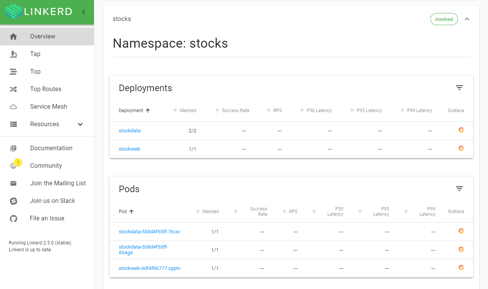

# Service meshes

A service mesh is an infrastructure component that takes control of routing service requests within a network. Service meshes can handle all kinds of network-level concerns within a Kubernetes cluster, including service discovery, load-balancing, fault-tolerance, encryption and monitoring.

Kubernetes service meshes work by adding an extra container, called a *sidecar proxy*, to each pod included in the mesh. The proxy takes over handling all inbound and outbound network requests, allowing configuration and management of networking matters to be kept separate from the application containers and, in many cases, without requiring any changes to the application code.

Take the [previous chapter's example](kubernetes.md#testing-the-application), where the gRPC requests from the web application were all routed to a single instance of the gRPC service. This happens because the service's hostname is resolved to an IP address, and that IP address is cached for the lifetime of the `HttpClientHandler` instance. It might be possible to work around this by handling DNS lookups manually or creating multiple clients, but this would complicate the application code considerably without adding any business or customer value.

Using a service mesh, the requests from the application container are sent to the sidecar proxy, which can distribute them intelligently across all instances of the other service. The mesh will also be able to response seamlessly to failures of individual instances of a service, handle retry semantics for failed calls or timeouts, or re-route failed requests to an alternate instance without returning to the client application at all.

Here is a screenshot of the StockWeb application running with the Linkerd service mesh, with no changes to the application code, or even the Docker image being used. The only change required was the addition of an annotation to the Deployment in the YAML files for the `stockdata` and `stockweb` services.


You can see from the Server column that the requests from the StockWeb application have been routed to both replicas of the StockData service, despite originating from a single `HttpClient` instance in the application code. In fact, if you review the code, you will see that all 100 requests to the StockData service are made simultaneously using the same `HttpClient` instance, yet with the service mesh, those requests will be balanced across however many service instances are available.

Service meshes only apply to traffic within a cluster. For external clients, see [the next chapter, Load Balancing](load-balancing.md).

## Service mesh options

There are three general-purpose service mesh implementations currently available for use with Kubernetes: Istio, Linkerd and Consul Connect. All three provide request routing/proxying, traffic encryption, resilience, host-to-host authentication and traffic control.

Choosing a service mesh depends multiple factors: the organization's specific requirements around costs, compliance, paid support plans, etc; the nature of the cluster, its size, the number of services deployed, and the volume of traffic within the cluster network; and ease of deploying and managing the mesh and using it with services.

More information on each service mesh is available from their respective websites.

- [**Istio** - istio.io](https://istio.io)
- [**Linkerd** - linkerd.io](https://linkerd.io)
- [**Consul** - consul.io/mesh.html](https://consul.io/mesh.html)

## Example: adding Linkerd to a deployment

In this example, you will learn how to use the Linkerd service mesh with the *StockKube* application from [the previous section](kubernetes.md).
To follow this example, you will need to [install the Linkerd command line interface](https://linkerd.io/2/getting-started/#step-1-install-the-cli). Windows binaries can be downloaded from the GitHub releases section; make sure to use the most recent **stable** release and not one of the edge releases.

With the Linkerd CLI installed, follow the [*Getting Started* instructions on the Linkerd web site] to install the Linkerd components on your Kubernetes cluster. The instructions are straight-forward and installation should only take a couple of minutes on a local Kubernetes instance.

### Adding Linkerd to Kubernetes deployments

The Linkerd CLI provides an `inject` command to add the necessary sections and properties to Kubernetes files. You can run the command and write the output to a new file.

```console
linkerd inject stockdata.yml > stockdata-with-mesh.yml
linkerd inject stockweb.yml > stockweb-with-mesh.yml
```

You can inspect the new files to see what changes have been made. For Deployment objects, a metadata annotation is added to tell Linkerd to inject a sidecar proxy container into the Pod when it is created.

It is also possible to pipe the output of the `linkerd inject` command to `kubectl` directly. The following commands will work in PowerShell or any Linux shell.

```console
linkerd inject stockdata.yml | kubectl apply -f -
linkerd inject stockweb.yml | kubectl apply -f -
```

### Inspecting services in the Linkerd dashboard

Launch the Linkerd dashboard using the `linkerd` CLI.

```console
linkerd dashboard
```

The dashboard provides detailed information about all services that are connected to the mesh.



If you increase the number of replicas of the StockData gRPC service (as shown below), and refresh the StockWeb page in the browser, you should see a mix of IDs in the Server column, indicating that requests are being served by all the available instances.

```yaml
apiVersion: apps/v1
kind: Deployment
metadata:
  name: stockdata
  namespace: stocks
spec:
  selector:
    matchLabels:
      run: stockdata
  replicas: 2 # Increase the target number of instances
  template:
    metadata:
      annotations:
        linkerd.io/inject: enabled
      creationTimestamp: null
      labels:
        run: stockdata
    spec:
      containers:
      - name: stockdata
        image: stockdata:1.0.0
        imagePullPolicy: Never
        resources:
          limits:
            cpu: 100m
            memory: 100Mi
        ports:
        - containerPort: 80
```

>[!div class="step-by-step"]
<!-->[Next](load-balancing.md)-->
